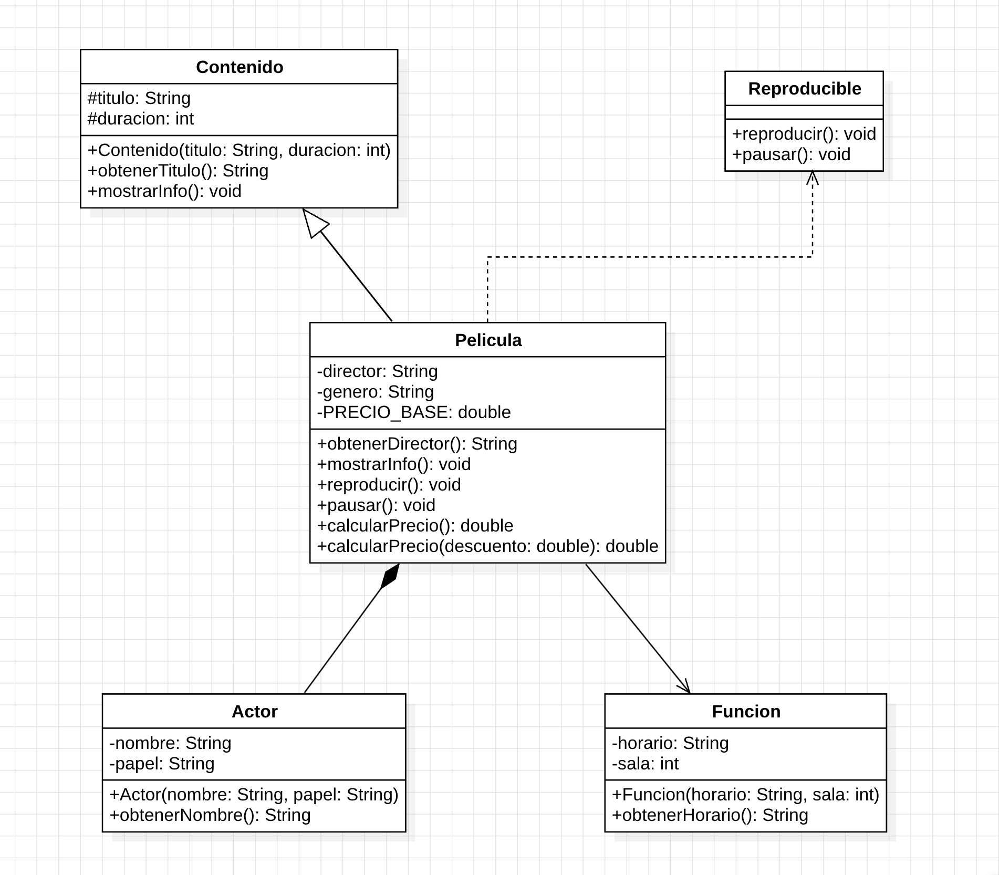
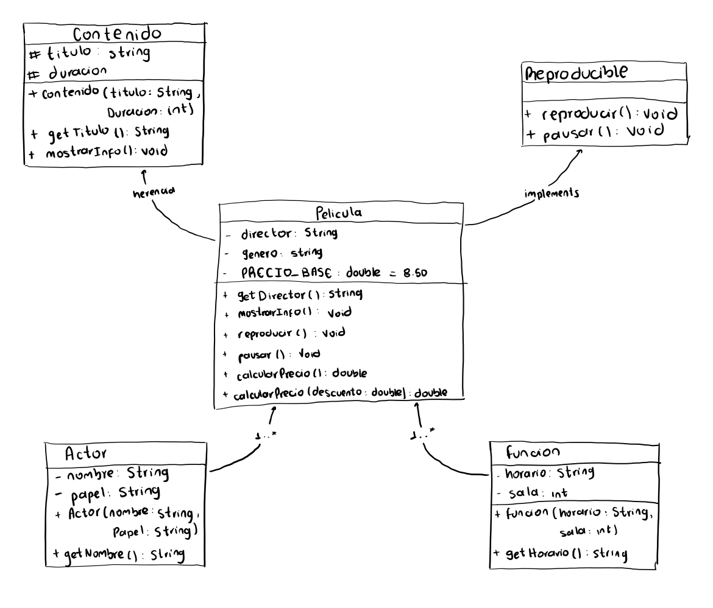

# Taller 1 - Aplicaciones Móviles
## Diagrama

Realizar el diagrama de clase usando UML el modelo del sistema que represente los conceptos de una pelicula de cartelera. Se debe realizar el diseño en hoja de papel, tablero, tablet, usando una ténica de mano alzada para crear un primer borrador, luego se debe digitalizar el diagrama usando starUML. Debe incluir relaciones de herencia, interfaces, clases abstractas, constantes, relaciones entre clases, constructores, sobrecarga, polimorfismo.

## Evidencia

